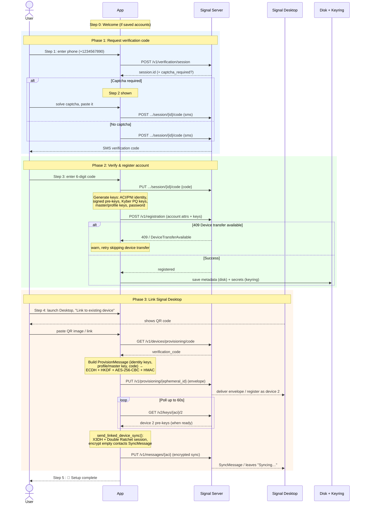

<p align="center">
  
</p>

# Setup Signal without smartphone

A Desktop application to register an account with Signal and link it with
Signal Desktop, all without requiring a smartphone.


*Note that Signal still requires a phone number to be used. This utility avoids the
need of a *smart*phone, but will still require a way to receive SMS
messages during the setup phase*

Grab [the latest release!](https://github.com/almet/signal-without-smartphone/releases)

## But, why?

There are multiple reasons why this tool might be interesting to you:

### Don't compromise the security of your messages with a smartphone

The security of your signal conversations is as low as the security of the devices on which it is installed:

> If your device is lost or stolen when it’s not locked with your passcode, of course someone could read the messages on it. Likewise, law enforcement entities are known to use forensic tools to break into seized devices, making it possible to read anything on the device, including your messages.
> 
> — [Signal group safety, Freedom of the Press Foundation](https://freedom.press/digisec/blog/signal-group-safety/)

### You might just not have a smartphone

Some people don't have a smartphone, and they should be able to use Signal :-)

## Why a separate tool?

As of now, Signal Desktop requires a phone number and a smartphone to set up an
account. This [might change in the
future](https://m.youtube.com/watch?v=C9equPLhKxY&t=19s) but until then, you can use this.

> "I assume your question is in regards to sort of like phone number signup
> that exists on Signal today. That is something we are looking at hopefully
> for later on this year adding a way to sign up without phone numbers. [...]"
>
> — Ehren Kret, Signal CTO, Jul 20 2026


## Install

Download the file for your system from the [releases page](https://github.com/almet/signal-without-smartphone/releases):

- **macOS**: Open the `.dmg` and drag **Signal Setup** into Applications.
- **Linux**: `AppImage`: Make it executable (`chmod +x Signal_Setup-*.AppImage`) and run it. A plain `signal-setup-linux-*` binary is also published if you prefer.
- **Windows**: Double-click to run.

### First launch on macOS and Windows

The releases are not signed with a paid developer certificate ($99 USD per year for
macOS, even more for Windows), and as a result the system warns you after install:

- **macOS** shows "cannot be opened because it is from an unidentified
  developer." Right-click the app and choose **Open**, then confirm. You only
  need to do this once. If it reports the app is "damaged," clear the download
  quarantine flag: `xattr -dr com.apple.quarantine "/Applications/Signal Setup.app"`.

- **Windows** SmartScreen shows "Windows protected your PC." Click **More
  info**, then **Run anyway**.

## Want to build it yourself?

```bash
cargo build --release
./target/release/signal-setup
```

The project is a Cargo workspace with two crates: `signal-setup-core` (the
Signal registration and device-linking logic) and `signal-setup` (the desktop
GUI that depends on it). Building the workspace produces the `signal-setup`
binary above.

## Build requirements

On Linux only, a few system libraries are useful for GPU/display:

```bash
# Ubuntu / Debian
sudo apt install libxcb-render0-dev libxcb-shape0-dev libxcb-xfixes0-dev \
libxkbcommon-dev libssl-dev protobuf-compiler

# Fedora
sudo dnf install libxcb-devel libxkbcommon-devel openssl-devel protobuf-compiler

# Arch
sudo pacman -S libxcb libxkbcommon openssl protobuf
```

## Testing with Signal's staging server

You can run the tool against Signal's staging environment instead of production,
which is useful for development and testing without risking your real account:

```bash
./target/release/signal-setup --staging
```

To complete the device-linking step, you'll need a Signal Desktop instance also
connected to the staging server. Building Signal Desktop from source does this
by default:

```bash
git clone https://github.com/signalapp/Signal-Desktop.git
cd Signal-Desktop
pnpm install
pnpm start
```
A `--demo` flag is also available for fully offline testing with fake data (no
server needed).

## Under the hood

There are other tools able to do this, such as the awesome [signal-cli](https://github.com/AsamK/signal-cli) by AsamK, but unfortunately they don't provide a graphical user interface. A previous version of this tool was using it under the hood, but needed users to have a JVM installed in order to run things.

Instead — and because I thought it would be easier — I used the occasion to take a deep dive into Signal's crypto.

Here is a high level of how things work (this application registers as the primary signal device, and then links Signal Desktop as a secondary device).

Here is the flow:



## License

```
Signal Without Smartphone
Copyright (C) 2026 Alexis Métaireau

This program is free software: you can redistribute it and/or modify
it under the terms of the GNU Affero General Public License as published
by the Free Software Foundation, either version 3 of the License, or
(at your option) any later version.

This program is distributed in the hope that it will be useful,
but WITHOUT ANY WARRANTY; without even the implied warranty of
MERCHANTABILITY or FITNESS FOR A PARTICULAR PURPOSE.  See the
GNU Affero General Public License for more details.

You should have received a copy of the GNU Affero General Public License
along with this program.  If not, see <https://www.gnu.org/licenses/>.
```
